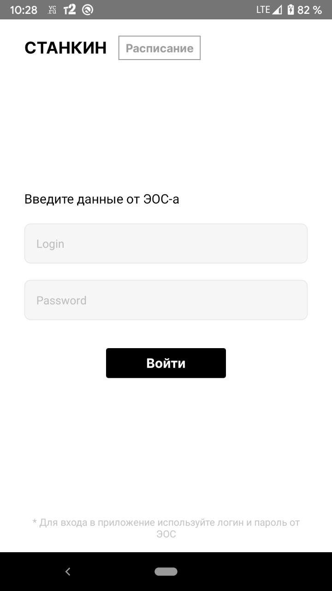
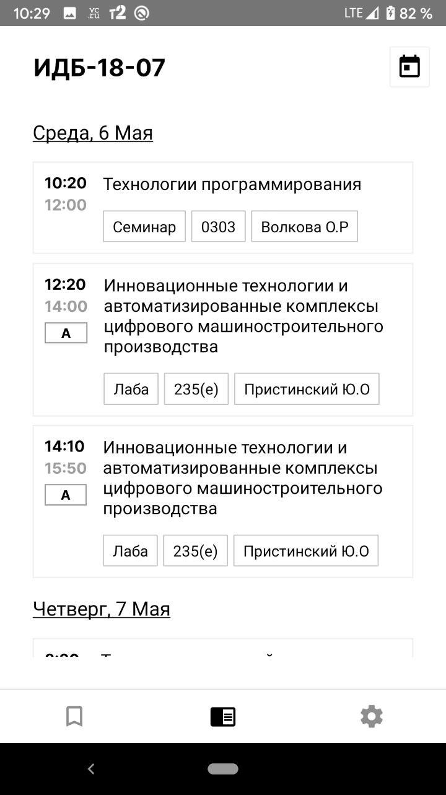
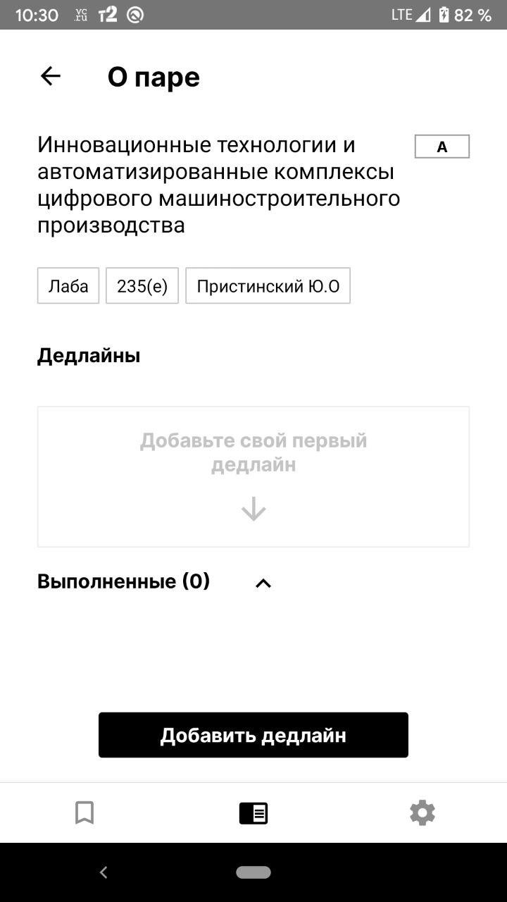
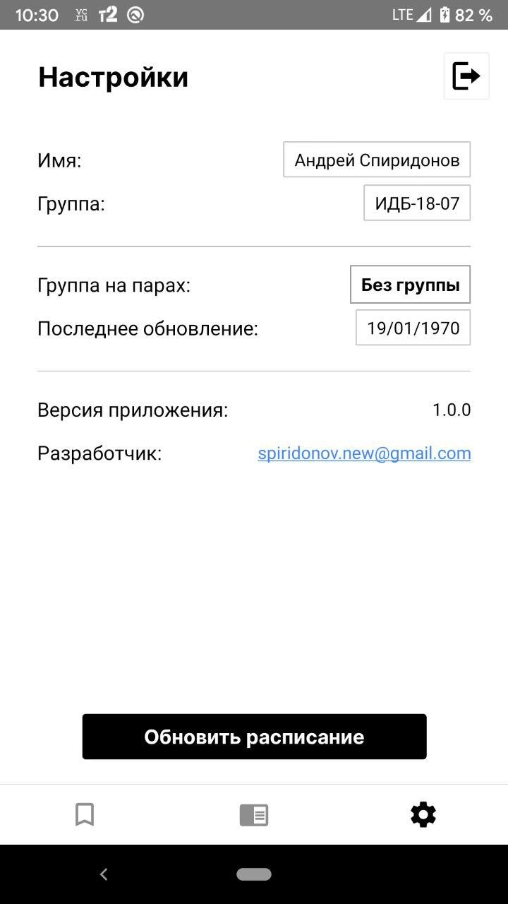
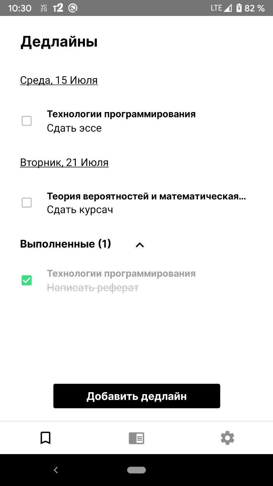
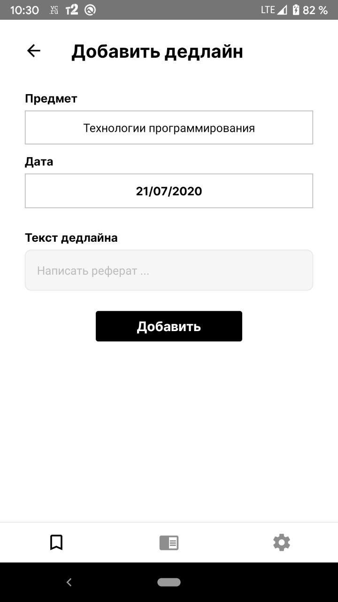

## Stankin mobile

Это приложение предназначено для студентов вуза СТАНКИН, для удобного просмотра расписания через мобильное приложение.

В проекте использовались:

- React
- Redux
- Saga
- Styled-components
- Redux-persist

### Screenshots

 | 
 | 
 | 
